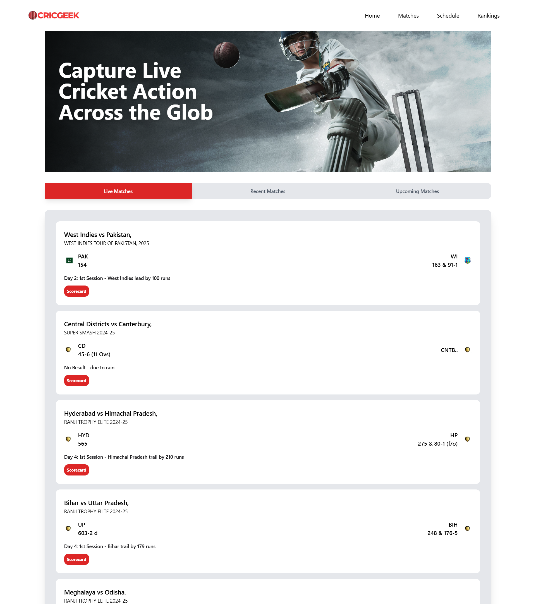
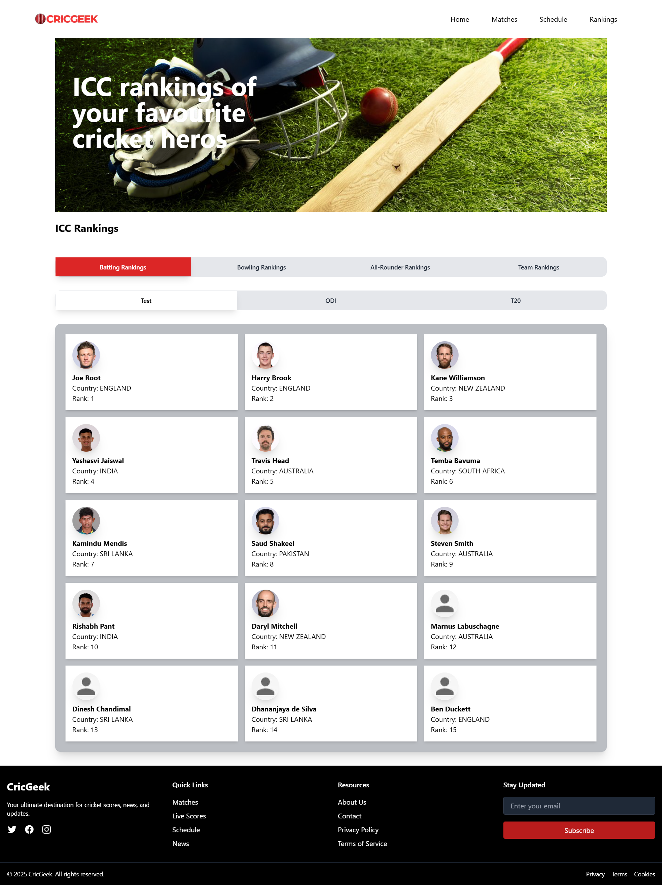
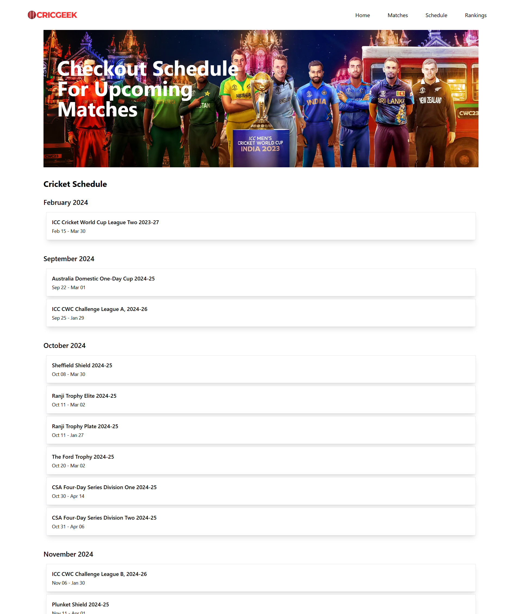
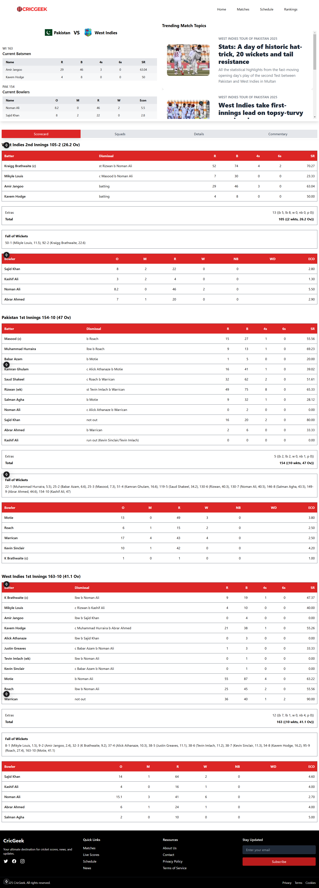
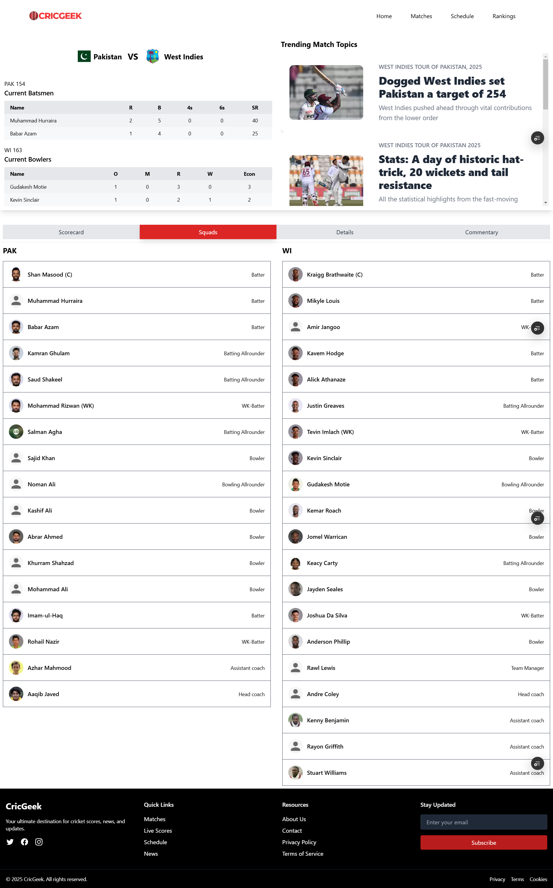
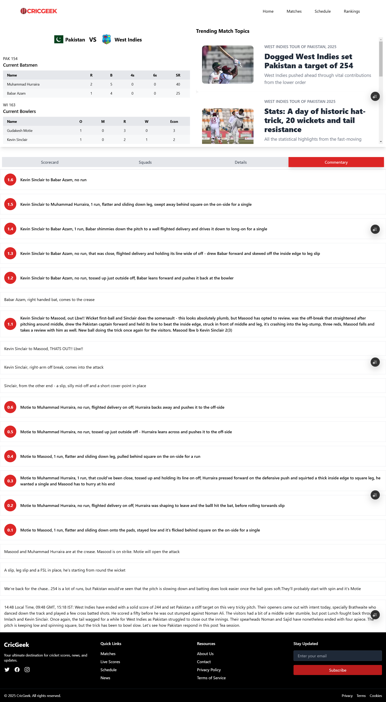

# CricGeek

**CricGeek** is a comprehensive platform designed to provide users with detailed cricket match statistics, rankings, and schedules. It includes live match scores, player rankings, team statistics, and more. The app allows cricket enthusiasts to stay updated with the latest happenings in the cricket world.

## Features

- **All Matches**: Get updates on ongoing matches, recent and upcoming matches.
- **Live Scorecards**: Get real-time updates on ongoing matches with detailed scorecards.
- **Player Rankings**: View the latest player rankings based on their performance in various formats.
- **Match Schedules**: Access upcoming match schedules and timings for your favorite teams.
- **Ranking Variations**: See changes in player rankings over time.
  
## Screenshots

Here are some screenshots showcasing the features of CricGeek:

### Home Page


### Matches Page


### Rankings


### Rankings Variation


### Schedule Page


### Scorecard


### Squads


### Commantary


## Installation

Clone this repository to your local machine:

```bash
git clone https://github.com/Abhip32/CricGeek.git
